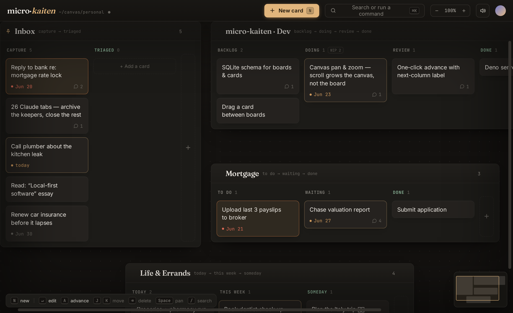
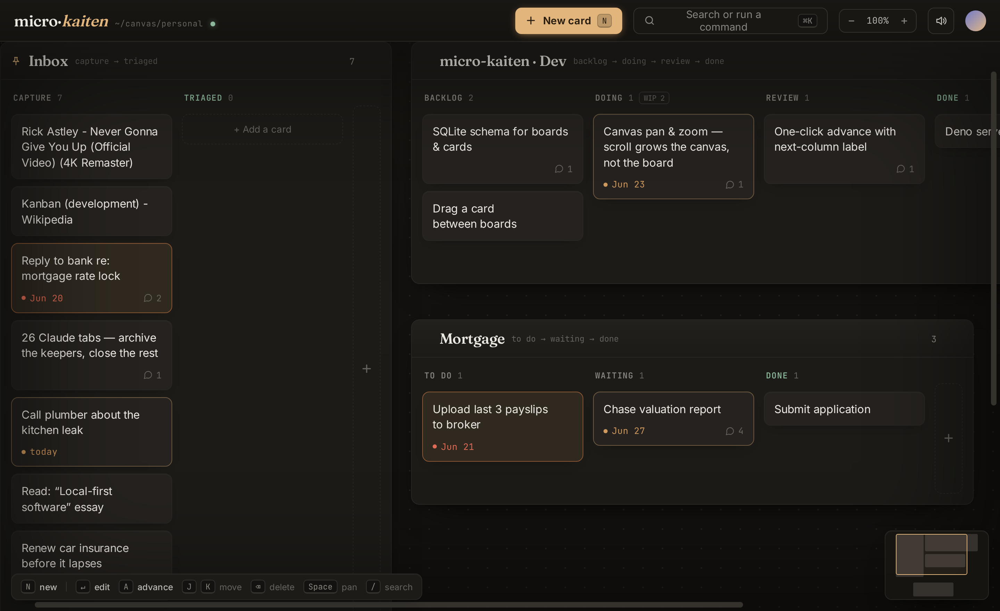

# mk — micro-kaiten

[](https://github.com/umag/mk/actions/workflows/ci.yml)
[](https://github.com/umag/mk/actions/workflows/release.yml)
[](https://hub.docker.com/r/umagistr/mk)
[](https://github.com/sponsors/umag)
[](https://www.patreon.com/_Magistr_)

A self-hosted **personal kanban canvas**: many boards laid out in one spatial
area instead of one board at a time. Capture a thought in a keystroke, advance it
one column at a time, pan across the canvas. Single-user, no accounts, no cloud —
a small Deno + SQLite backend and a dependency-light Vite/TS frontend.

If micro-kaiten is useful to you, please consider supporting its maintenance via
[**❤️ GitHub Sponsors**](https://github.com/sponsors/umag) or
[**Patreon**](https://www.patreon.com/_Magistr_).



> A calm, spatial take on the multi-board kanban idea. See [`DESIGN.md`](DESIGN.md)
> and [`PRODUCT.md`](PRODUCT.md).

## Highlights

- **One spatial canvas** of draggable boards; a pinned top-left **anchor** board, the
  rest snap to its right and below. Pan/zoom with inertia; a minimap and canvas scrollbars.
- **Capture + advance** as the only first-class acts — keyboard-first throughout
  (`N` new · `A` advance · `J/K` move · `⌘K` palette · `/` search).
- **Calm, deadline-aware cards** — title, optional date (coloured by deadline), comment count.
- **Labels** — tag cards with colour-coded labels (the colour is derived from the text), then
  filter the whole canvas by one or more labels from the top-bar funnel, a card's chip, or `⌘K`.
- **Paste a link** — the card titles itself from the page; the URL drops into notes. Works for
  articles (`og:title`/`<title>`) and **YouTube** (via oEmbed). Existing URL-titled cards backfill.
- **Bespoke date picker**, inline column rename, card-detail sheet with notes + comments.
- **Hidden Archive** — cards done ≥ 10 days auto-move there (swept server-side, headless).
- **REST API** for external card/board/column management — see [`server/API.md`](server/API.md).



## Run with Docker

One container (Deno serves the API **and** the built frontend on port 8787),
pulling the image CI publishes to Docker Hub:

```bash
docker compose up        # pulls umagistr/mk → open http://localhost:8787
```

Or run it directly:

```bash
docker run -p 8787:8787 -v mk-data:/data umagistr/mk
```

The SQLite database persists in the `mk-data` volume (`/data/mk.db`). Override the
port with `MK_PORT`. To build from source instead, uncomment `build: .` in
`docker-compose.yml` (or `docker build -t mk .`).

**Image tags** (`umagistr/mk`): `latest` = newest release · `YYYY.MM.DD.N` = a
specific [CalVer](https://calver.org) release (e.g. `2026.06.22.1`). Every push to
`main` cuts a CalVer release via the **Release (CalVer)** workflow — there are no
SHA-tagged images; each release builds the image and opens a matching GitHub release.

## Develop

Two processes — the Vite dev server (frontend, proxies `/api` → the backend) and
the Deno + SQLite API:

```bash
npm install
deno task server      # API on :8787  (writes ./mk.db)
npm run dev           # app on :5173
```

Useful scripts: `npm run gate` (typecheck + unit tests), `npm run build` (production
frontend → `dist/`), `npm run e2e` (Playwright), `deno check server/main.ts`.

## Layout

```
src/            frontend (canvas, render, store, core reducer/ops, calendar, …)
src/core/       pure domain: state reducer, ops, due/done/archive logic (shared with the server)
server/         Deno + SQLite API + static file serving   (API.md = reference)
tests/          vitest unit tests        e2e/  Playwright scenarios
```

The browser store and the server run the **same `src/core` reducer**, so the app
and the API can never disagree about what a change means.

## Tech

Vite · TypeScript · hand-rolled CSS (OKLCH) · Deno · `node:sqlite`. No UI framework.
Localhost, no auth by design.
